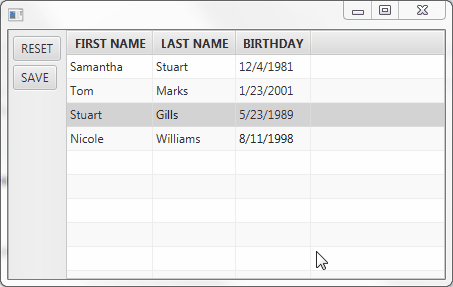

### Dirty state-tracking properties and collections for JavaFX

I built this library out of tremendous need to keep track of dirty states in various JavaFX Properties and Collections, as well as rebaseline and reset against the dirty values. 

You may likely use this library for CRUD operations, while allowing users the ability to review dirty edits before commiting or reverting them. For instance, you can bind the dirty states to red text formatting [like in this demo application](https://github.com/thomasnield/rxkotlinfx-tornadofx-demo). 



Here are the current types:

```
DirtyBooleanProperty
DirtyIntegerProperty
DirtyLongProperty
DirtyObjectProperty
DirtyStringProperty
DirtyObservableList
DirtyObservableMap
DirtyObservableSet
DirtyListProperty
DirtySetProperty
DirtyMapProperty
DirtyReadOnlyWrapper
CompositeDirtyProperty
```

Each of these dirty-tracking components have the same behaviors as their vanilla JavaFX counterparts, but have three additional methods/properties:

|Property/Method|Description|
|----|----|
|isDirtyProperty()|Read-only ObservableValue indicating whether this item is dirty|
|isDirty|Delegates to isDirtyProperty()|
|reset()|Sets the value back to the baseline value, removing dirty state|
|rebaseline()|Sets the baseline value to the current value, resetting dirty state|

Note this was built in Kotlin, but works with both Java and Kotlin.


### Java Usage

```java
// Initialize with "Hello" being the baseline
DirtyObjectProperty<String> myProperty = new DirtyObjectProperty<>("Hello");

// Setting existing value should not change
myProperty.setValue("Hello");
Assert.assertFalse(myProperty.isDirty());

// Changing the value will result in a dirty state
myProperty.setValue("World");
Assert.assertTrue(myProperty.isDirty());

// Rebaselining will set the current value to be the new baseline
myProperty.rebaseline();
Assert.assertFalse(myProperty.isDirty());

// Reset will restore the baseline as the current value, and no longer be dirty
myProperty.setValue("Greetings");
myProperty.reset();
Assert.assertEquals("World", myProperty.getValue());
Assert.assertFalse(myProperty.isDirty());
```

### CompositeDirtyProperty

The `CompositeDirtyProperty` is a powerful utility that can manage dirty properties in sweeping fashion. All the `DirtyXXX` types in this library implement `DirtyProperty`, and the `CompositeDirtyProperty` accepts any number of `DirtyProperty` items and aggregates their state.

It can also `rebaseline()` or `reset()` all the items it is tracking.

```java
CompositeDirtyProperty composite = new CompositeDirtyProperty();

DirtyObjectProperty<Integer> property1 = new DirtyObjectProperty<>(3);
DirtyObjectProperty<Integer> property2 = new DirtyObjectProperty<>(2);
DirtyObservableList<String> list1 = new DirtyObservableList<>(Arrays.asList("Alpha","Beta","Gamma"));
DirtyObservableList<String> list2 = new DirtyObservableList<>(Arrays.asList("Zeta","Theta","Eta"));

composite.addAll(property1,property2,list1,list2);
Assert.assertFalse(composite.isDirty());

property1.setValue(3);
Assert.assertFalse(composite.isDirty());

property1.setValue(4);
Assert.assertTrue(composite.isDirty());

composite.reset();
Assert.assertEquals(3, (int) property1.getValue());
Assert.assertFalse(composite.isDirty());

list1.add("Delta");
Assert.assertTrue(composite.isDirty());

composite.rebaseline();
Assert.assertFalse(composite.isDirty());
Assert.assertArrayEquals(list1.toArray(), new String[] {"Alpha", "Beta", "Gamma", "Delta"});
```


### Context Example - CRUD Interface

Here is a simple CRUD-like user interface built with Kotlin and [TornadoFX](https://github.com/edvin/tornadofx). 


```kotlin 
import javafx.application.Application
import javafx.beans.property.SimpleObjectProperty
import javafx.collections.FXCollections
import javafx.geometry.Orientation
import javafx.scene.paint.Color
import org.nield.dirtyfx.beans.DirtyObjectProperty
import org.nield.dirtyfx.beans.DirtyStringProperty
import org.nield.dirtyfx.extensions.addTo
import org.nield.dirtyfx.tracking.CompositeDirtyProperty
import tornadofx.*
import java.time.LocalDate


fun main(args: Array<String>) {
    Application.launch(MyApp::class.java, *args)
}

class MyApp: App(MyView::class)

class MyView: View() {

    val customers = FXCollections.observableArrayList(
            Person("Samantha","Stuart",LocalDate.of(1981,12,4)),
            Person("Tom","Marks",LocalDate.of(2001,1,23)),
            Person("Stuart","Gills",LocalDate.of(1989,5,23)),
            Person("Nicole","Williams",LocalDate.of(1998,8,11))
    )

    val selectedCustomer = SimpleObjectProperty<Person>()

    override val root = borderpane {
        
        left = toolbar {
            orientation = Orientation.VERTICAL

            button("RESET") {
                setOnAction {
                    selectedCustomer.get()?.reset()
                }
            }

            button("SAVE") {
                setOnAction {
                    selectedCustomer.get()?.save()
                }
            }
        }

        center = tableview(customers) {

            selectedCustomer.bind(selectionModel.selectedItemProperty())

            column("FIRST NAME", Person::firstNameProperty) {
                makeEditable()
                cellDecorator {
                    rowItem.firstNameProperty.isDirtyProperty().addListener { o, oldValue, newValue ->
                        textFill = if (newValue) Color.RED else Color.BLACK
                    }
                }
            }

            column("LAST NAME", Person::lastNameProperty) {
                makeEditable()
                cellDecorator {
                    rowItem.lastNameProperty.isDirtyProperty().addListener { o, oldValue, newValue ->
                        textFill = if (newValue) Color.RED else Color.BLACK
                    }
                }
            }

            column("BIRTHDAY", Person::birthdayProperty) {
                makeEditable()
                cellDecorator {
                    rowItem.birthdayProperty.isDirtyProperty().addListener { o, oldValue, newValue ->
                        textFill = if (newValue) Color.RED else Color.BLACK
                    }
                }
            }
            isEditable = true
        }
    }
}

class Person(firstName: String, lastName: String, birthday: LocalDate) {

    val dirtyStates = CompositeDirtyProperty()

    val firstNameProperty = DirtyStringProperty(firstName).addTo(dirtyStates)
    var firstName by firstNameProperty

    val lastNameProperty = DirtyStringProperty(lastName).addTo(dirtyStates)
    var lastName by lastNameProperty

    val birthdayProperty = DirtyObjectProperty(birthday).addTo(dirtyStates)
    var birthday by birthdayProperty


    fun reset() = dirtyStates.reset()
    fun save() = dirtyStates.rebaseline()
}
```

### Dependencies

**Maven**

```xml 
<dependency>
    <groupId>org.nield</groupId>
    <artifactId>dirtyfx</artifactId>
    <version>0.1.2</version>
</dependency>
```

**Gradle**

```groovy
compile 'org.nield:dirtyfx:0.1.2'
```
